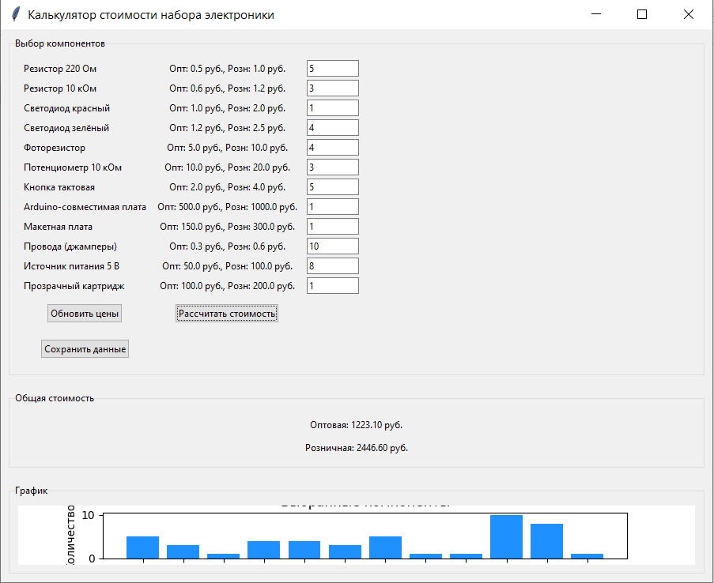

# ElectronicsKitCalculator

Приложение для расчёта стоимости набора электроники с графическим интерфейсом.

## Описание
Это приложение позволяет:
- Выбирать компоненты (резисторы, светодиоды, Arduino и т.д.) и их количество.
- Обновлять оптовые и розничные цены.
- Рассчитывать общую стоимость набора.
- Отображать и сохранять график выбранных компонентов.
- Сохранять данные в CSV-файл.

Проект основан на данных из презентации "Разработка стенда схемотехники" (Рыжакова, Кошурин, Меркулова).

## Установка
1. Убедитесь, что установлен Python 3.9 или новее.
2. Установите зависимости: pip install matplotlib numpy
3. Клонируйте репозиторий: git clone https://github.com/nadyamerck/ElectronicsKitCalculator.git
4. Перейдите в папку проекта: cd ElectronicsKitCalculator
5. Запустите приложение: python src/electronics_app.py

## Сборка исполняемого файла (опционально)
1. Установите `pyinstaller`: pip install pyinstaller
2. Соберите .exe: pyinstaller --onefile --noconsole src/electronics_app.py
3. Найдите файл в `dist/electronics_app.exe`.

## Использование
- Введите количество компонентов в соответствующих полях.
- Нажмите "Рассчитать стоимость" для вывода результатов и графика.
- Используйте "Обновить цены" для изменения цен.
- Нажмите "Сохранить данные" для экспорта в `components.csv`.
- Нажмите "Сохранить график" для экспорта графика как `plot.png`.

## Структура репозитория
- `src/`: Исходный код (electronics_app.py).
- `docs/`: Документация (например, PDF презентации).
- `data/`: Данные (например, market_data.csv).
- `images/`: Скриншоты и изображения.
- `dist/`: Исполняемые файлы (опционально).
- `.gitignore`: Файлы для игнорирования.
- `LICENSE`: Лицензия проекта.
- `README.md`: Документация проекта.

## Документация
- [Презентация проекта](docs/Разработка_стенда_схемотех_РыжаковаКошуринМеркулова4931102_30002.pdf)

## Лицензия
[MIT License](LICENSE)

## Авторы
- [nadyamerck](https://github.com/nadyamerk)
- Команда: Рыжакова, Кошурин, Меркулова

## Скриншот

## Благодарности
Спасибо компании РОББО и наставнику Сергею Олеговичу Мельникову за поддержку проекта.